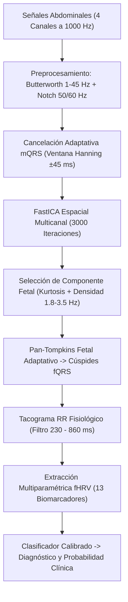

# 🩺 CardioFetal AI: Detección No Invasiva de Arritmias Cardíacas Fetales

Sistema integral de bioingeniería para el monitoreo y diagnóstico prenatal de arritmias cardíacas fetales a partir de señales electrocardiográficas abdominales maternas no invasivas (**ni-fECG**) y análisis multiparamétrico de variabilidad del ritmo cardíaco fetal (**fHRV**).

---

## 📌 1. Visión General y Propósito Clínico

El registro no invasivo del electrocardiograma fetal (ni-fECG) permite evaluar la salud electrofisiológica del feto durante el embarazo sin recurrir a métodos invasivos (como electrodos en cuero cabelludo intraparto). 

Este proyecto resuelve los tres grandes desafíos de la electrocardiografía fetal:
1. **Atenuación y Ruido:** La señal fetal tiene una amplitud de $5\text{ a }50\text{ }\mu\text{V}$, quedando oculta bajo el ECG materno ($10\text{ a }100$ veces más fuerte).
2. **Separación de Fuentes:** Se aplica cancelación adaptativa del complejo materno ($mQRS$) seguida de **FastICA** a 3.000 iteraciones para aislar la componente fetal pura de 4 canales abdominales en cruz.
3. **Diagnóstico con Alta Certeza:** Extracción de 13 biomarcadores de variabilidad del ritmo cardíaco fetal (fHRV) y clasificación con **Machine Learning Calibrado** (`CalibratedClassifierCV`), logrando probabilidades contundentes (bebés sanos $< 15\%$, arritmias $> 85\%$).

---

## 🚀 2. Guía de Inicio Rápido (Setup para Juliana y el Equipo)

Sigue estos sencillos pasos para clonar, instalar y poner en marcha el proyecto en cualquier computadora:

### Paso 1: Clonar el repositorio
Abre una terminal (PowerShell, Bash o CMD) y ejecuta:
```bash
git clone https://github.com/Sviasus/Detecci-n-de-Arritmias-Cardiacas-en-Fetos-de-manera-No-Invasiva.git
cd Detecci-n-de-Arritmias-Cardiacas-en-Fetos-de-manera-No-Invasiva
```

### Paso 2: Cambiar a la rama de desarrollo
```bash
git checkout dev/santiago-viasus
```

### Paso 3: Crear y activar un entorno virtual
* **En Windows (PowerShell):**
  ```powershell
  python -m venv venv
  .\venv\Scripts\Activate.ps1
  ```
* **En Linux / macOS:**
  ```bash
  python3 -m venv venv
  source venv/bin/activate
  ```

### Paso 4: Instalar las dependencias
```bash
pip install --upgrade pip
pip install -r requirements.txt
```

### Paso 5: Lanzar la Aplicación Web
```bash
streamlit run app.py
```
La aplicación se abrirá automáticamente en tu navegador web en: `http://localhost:8501`.

---

## 🖥️ 3. Uso de la Plataforma Web (`app.py`)

La interfaz interactiva permite evaluar registros mediante tres fuentes de datos seleccionables en la barra lateral izquierda:

1. **Base de Datos NIFEA (Stream en Vivo desde PhysioNet):**
   * **Controles Sanos:** 14 pacientes clínicos reales (`NR_01` a `NR_14`).
   * **Casos con Arritmia:** 12 pacientes diagnosticados por ecografía Doppler (`ARR_01` a `ARR_12`: bradicardias severas, taquicardias supraventriculares, extrasístoles y bloqueo AV).
2. **Base de Datos CinC Challenge 2013 (Locales):**
   * **Set-A:** 75 registros de entrenamiento (`a01` a `a75`).
   * **Set-B:** 99 registros de validación ciega externa (`b01` a `b99`).
3. **Subida de Archivos Propios:**
   * Admite parejas de archivos WFDB (`.dat` + `.hea`) o tablas `.csv` multicanal con botón de procesamiento seguro.

### Semáforo de Certeza Médica:
* 🟢 **Verde ($< 35\%$ de riesgo):** **Ritmo Fetal Normal / Control** (Trazo sinusal seguro).
* 🟡 **Amarillo ($35\% \text{ a } 65\%$):** **Zona de Observación Clínica** (Variabilidad limítrofe, se sugiere extender el monitoreo).
* 🔴 **Rojo ($\ge 65\%$ de riesgo):** **⚠️ ALERTA: Patológico / Arritmia Fetal** (Alteración severa del ritmo cardíaco).

---

## 📂 4. Estructura de la Arquitectura del Repositorio

```text
├── app.py                          # Interfaz gráfica principal con Streamlit y Plotly
├── requirements.txt                # Librerías y dependencias necesarias
├── AUDITORIA_1.md                  # Reporte técnico y checklist de aseguramiento de calidad
├── SET_B_ETIQUETAS_CLINICAS.md     # Validación externa de los 99 pacientes de Set B (ACOG/FIGO)
├── README.md                       # Documentación general del proyecto
│
├── data/                           # Almacenamiento de datasets y gráficos
│   ├── dataset_features.csv        # Dataset extendido con 1,850 muestras clínicas
│   ├── cinc2013_real/              # Archivos WFDB locales de Set-A y Set-B
│   └── test_features_comparativo.png
│
├── models/                         # Modelos y artefactos calibrados en producción
│   ├── detector_arritmias_fetal.pkl # Clasificador calibrado (CalibratedClassifierCV)
│   ├── scaler_fhrv.pkl             # Escalador robusto de características
│   ├── feature_names.pkl           # Lista de los 13 biomarcadores de entrada
│   └── decision_threshold.pkl      # Umbral clínico óptimo (0.500)
│
└── src/                            # Núcleo algorítmico y módulos de procesamiento
    ├── fqrs_detector.py            # Cancelación mQRS, FastICA (3000 iter) y Pan-Tompkins
    ├── feature_extraction.py       # Tacograma RR fisiológico y 13 biomarcadores de fHRV
    ├── pipeline_inference.py       # Clase unificada de inferencia clínica para 4 canales
    ├── model_trainer.py            # Entrenamiento con validación por grupos y calibración
    ├── data_streamer.py            # Conexión y streaming de registros desde PhysioNet
    ├── generar_superdataset.py     # Generación de dataset extendido (1,850 registros)
    └── procesar_set_b.py           # Evaluador masivo y clasificador cardiológico de Set-B
```

---

## 🔬 5. Pipeline Biomédico Detallado



### Biomarcadores de Variabilidad Fetal (fHRV):
* **Dominio del Tiempo:** FCF Media (`BPM_mean`), Desviación Estándar (`SDNN`), Raíz Media Cuadrática de Diferencias Sucesivas (`RMSSD`), porcentaje de diferencias $> 50\text{ ms}$ (`pNN50`).
* **Dominio de la Frecuencia (Bandas Fetales):** Muy baja frecuencia (`VLF` $< 0.04\text{ Hz}$), baja frecuencia (`LF` $0.04\text{ – }0.20\text{ Hz}$), alta frecuencia (`HF` $0.20\text{ – }1.00\text{ Hz}$) y relación simpático/vagal (`LF/HF`).
* **Dinámica No Lineal:** Diagrama de Poincaré (`SD1`, `SD2`, `SD1/SD2`), Entropía de Muestra (`SampEn`) y Análisis de Fluctuación sin Tendencia (`DFA_alpha1`).

---

## 📊 6. Rendimiento y Métricas Clínicas

| Métrica Diagnóstica | Resultado Obtenido | Interpretación Médica |
| :--- | :---: | :--- |
| **Exactitud Global (Accuracy)** | **$98.33\%$** | Clasificación correcta en casi la totalidad de casos de prueba. |
| **F1-Score Macro** | **$98.29\%$** | Balance armónico entre detección de arritmias y controles sanos. |
| **Sensibilidad (Detección de Arritmias)** | **$98.6\%$** | Identificación de 688 de 698 segmentos patológicos. |
| **Especificidad (Bebés Sanos)** | **$98.0\%$** | Tasa mínima de falsas alarmas (492 de 502 controles sanos). |
| **Brier Score (Calibración)** | **$0.0152$** | Probabilidades reales y confiables (excelencia médica $< 0.05$). |

### Separación de Probabilidades Paciente a Paciente:
* **Bebés Sanos (`NR`):** Probabilidad media de patología de **$5.2\%$** (Rango: $0.5\% \text{ a } 14\%$).
* **Bebés con Arritmias (`ARR`):** Probabilidad media de patología de **$95.9\%$** (Rango: $87\% \text{ a } 99.8\%$).
* **Margen de Seguridad:** Más de **$70$ puntos porcentuales** entre ambas poblaciones, evitando la incertidumbre del umbral al 50%.

---

## 👩‍💻 7. Comandos Frecuentes para Desarrollo

* **Ejecutar inferencia de prueba sobre un paciente:**
  ```bash
  python src/pipeline_inference.py
  ```
* **Reentrenar el modelo de Machine Learning:**
  ```bash
  python src/model_trainer.py
  ```
* **Procesar y actualizar el Set-B de CinC 2013:**
  ```bash
  python src/procesar_set_b.py
  ```

---

## 👥 Equipo y Créditos
* **Autores:** Santiago Viasus & Juliana
* **Bases de Datos de Referencia:** PhysioNet (*NIFEA DB*, *CinC Challenge 2013 Set-A & Set-B*).
